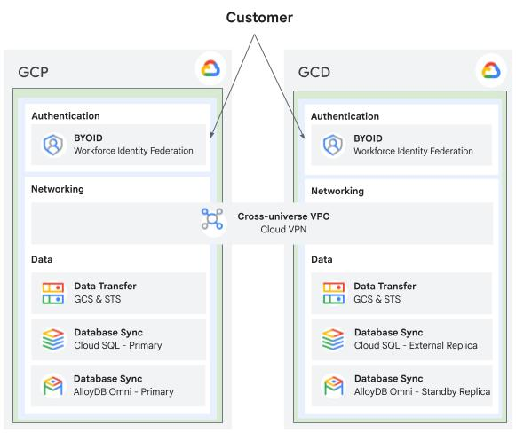

# "Sovereign standby" with multiple universes

## Table of Contents

- [Overview](#overview)
  - [Target Audience](#target-audience)
  - [Core Capabilities](#core-capabilities)
  - [Architecture](#architecture)
  - [Components](#components)
  - [Project Structure Overview](#project-structure-overview)
- [Disclaimer](#disclaimer)
  - [Technical & Operational Limitations](#technical--operational-limitations)
- [Authentication & Credentials](#authentication--credentials)
  - [GCP Authentication](#gcp-authentication)
  - [GCD Authentication](#gcd-authentication)
  - [kubectl Cluster Credentials Setup](#kubectl-cluster-credentials-setup)
- [Deployment](#deployment)
  - [1. Environment Configuration](#1-environment-configuration)
  - [2. Terraform Infrastructure Provisioning](#2-terraform-infrastructure-provisioning)
  - [3. Workforce Identity Federation (WIF)](#3-workforce-identity-federation-wif)
  - [4. Workload Deployment: Bank of Anthos](#4-workload-deployment-bank-of-anthos)
    - [4.1. Cloud SQL Flavor](#41-cloud-sql-flavor)
    - [4.2. AlloyDB Omni Flavor](#42-alloydb-omni-flavor)
  - [5. Application Verification](#5-application-verification)
  - [6. Promotion (`just promote`)](#6-promotion-just-promote)
  - [7. Resource Cleanup (`just destroy` and `just destroy-k8s`)](#7-resource-cleanup-just-destroy-and-just-destroy-k8s)
- [Storage Transfer Service (STS)](#storage-transfer-service-sts)
  - [STS Transfer Verification](#sts-transfer-verification)
  - [Debugging Agent Connection](#debugging-agent-connection)

---

## Overview

In today's cloud environment, large regulated organizations can face multi-layered risks to operational continuity: severe technical outages, evolving regulatory landscapes such as the EU Digital Operational Resilience Act (DORA) and General Data Protection Regulation (GDPR) mandates, and macroeconomic pressures.

This guide provides a blueprint for a "sovereign standby" architecture that addresses those challenges. In this example, the core retail banking application runs primarily on Google Cloud to leverage public cloud scale and global infrastructure. Simultaneously, a synchronized, near-real-time mirror environment is maintained on Google Cloud Dedicated.

If primary global cloud connectivity is severed, whether due to a regional blackout, unexpected macroeconomic shifts, or strict data sovereignty mandates, organizations can invoke a planned failover protocol. All live production traffic can be diverted to Google Cloud Dedicated enabling core banking operations to run isolated without losing data or dropping customer sessions.

**Please note that this is a proof-of-concept prototype built for demonstration purposes, and the implementation is not audited, hardened, or secured for production use cases.**

### Target Audience

Although this example uses a banking app, this solution is designed for cloud architects, platform engineers, and executive leaders in any regulated industries. It serves the following stakeholders:

- **Lead cloud security architects / Heads of Identity and Access Management** who enforce federated identity and security policies across administrative boundaries using Workforce Identity Federation and identity providers, ensuring user access persists seamlessly between universes without duplicated identities.
- **Lead SRE / Platform Architects** who configure automated cross-universe database replication, set up Storage Transfer Service for background asset sync, and maintain GitOps templates to ensure complete infrastructure parity.
- **Director of Core Operations** who monitor global operational health, track Recovery Time Objectives and Recovery Point Objectives, and hold ultimate authority to trigger the failover during disruptions.

### Core Capabilities

- **Multi-Universe Database Synchronization**: Real-time cross-universe database replication supporting both Cloud SQL and AlloyDB Omni between Google Cloud and Google Cloud Dedicated.
- **Infrastructure & Storage Parity**: Automated GitOps deployment templates and Storage Transfer Service agents maintain identical containerized banking microservices and Cloud Storage bucket assets across environments.
- **Federated Workforce Identity**: Single sign-on and role-based access control across independent administrative domains using Workforce Identity Federation and an external identity provider.
- **Deterministic Sovereign Database Failover**: One-step database promotion transitions the read-only replica on Google Cloud Dedicated into an independent standalone primary during an outage.
- **Bi-Directional Secure Network Bridge**: Encrypted HA VPN connectivity and Private Service Connect endpoints linking cross-universe Google Kubernetes Engine (GKE) clusters and databases.

### Architecture

This architecture connects a primary Google Cloud production universe with a Google Cloud Dedicated standby universe by using an encrypted HA VPN bridge. The solution synchronizes data and microservices continuously to ensure zero data loss and immediate failover readiness.



### Components

Component | Tech | Purpose
:--- | :--- | :---
**Microservices** | GKE | Identical "Bank of Anthos" containerized banking applications running in the two universes.
**Database** | AlloyDB Omni **or** Cloud SQL | High-performance PostgreSQL ledger using Write Ahead Log (WAL) streaming for cross-universe transaction synchronization **or** Managed PostgreSQL database using pglogical replication for transaction ledger mirroring.
**Storage & Sync** | Cloud Storage Transfer Service running in Google Cloud | Secure object storage repositories and automated background transfer agent for assets and backups.
**Networking** | HA VPN and Private Service Connect | Encrypted cross-universe network bridge and Private Service Connect outbound endpoints.
**Identity** | Workforce Identity Federation and an external identity provider | Federated identity provider integration enabling unified single sign-on across universes.
**Orchestration** | Terraform & Helm | Automated infrastructure provisioning scripts and Kubernetes Helm chart packaging.

### Project Structure Overview

This table outlines the main directories within the project repository and their primary responsibilities.

Folder | Description
:--- | :---
**terraform/envs/** | Environment configuration files (`defaults.yaml`, `main.tf`, `outputs.tf`) for GCP and GCD.
**terraform/modules/** | Reusable Terraform modules (`network`, `gke`, `postgresql`, `sts`, `auth`, `monitoring`, `core`).
**k8s/helm/** | Kubernetes Helm charts for Bank of Anthos, Cloud SQL setup, cert-manager, and AlloyDB Omni.
**scripts/** | Python and Shell management scripts (`configure.py`, `check_config.py`, `promote.py`, `destroy.py`).
**justfile** | Standardized execution targets for deployment, configuration, promotion, and teardown (`just`).

## Disclaimer

> [!IMPORTANT]
> **Proof-of-Concept & Reference Implementation Only**
>
> This demonstration is designed solely as a reference architecture to showcase technical capabilities and cross-universe federation principles. It is **not audited, hardened, or secured for production deployment**. The Bank of Anthos sample application utilizes default JWT secrets, fixed demonstration passwords, and public ingress endpoints intended strictly for testing convenience.

### Technical & Operational Limitations

- **Replica Write Constraints**: Before executing a failover (`just promote`), the database instance deployed in the target sovereign universe (GCD) functions strictly as a downstream read-only replica. Attempting write operations (e.g., initiating fund transfers or modifying account state) on the replica Web UI prior to promotion will cause primary key sequence divergence, data drift, and replication failure.
- **One-Way Failover & DNS Management**: Failover execution is a one-way operation. This reference implementation does not provide automated failback mechanisms to resynchronize modified GCD data back to GCP. Furthermore, global DNS switching and traffic rerouting are not included and must be managed externally by the user.
- **Storage Transfer & Agent Dependencies**: Object replication via Storage Transfer Service (STS) relies on background VM agents and Cloud Storage FUSE mounts. Failures in agent startup scripts, docker container crashes, or permission shifts can disrupt file synchronization.
- **Monitoring Data Latency**: Metrics displayed on the cross-universe monitoring dashboard for VPN telemetry and ingress traffic experience an inherent processing delay of approximately 5 minutes.
- **Universe Credential Switching**: Operations across dual universes require managing distinct `gcloud` workforce identity contexts. Session credentials must be explicitly refreshed and verified before running Terraform or Helm commands to avoid cross-universe state corruption.

---

## Authentication & Credentials

Before running Terraform commands (`terraform init`, `terraform apply`) or
`kubectl` commands, ensure you authenticate your session for the target universe.

### GCP Authentication

```bash
gcloud auth login
gcloud auth application-default login
```

### GCD Authentication

For Google Cloud Dedicated (GCD) authentication instructions, refer to the
[sovereign-solutions root documentation](../../README.md#google-cloud-cli).

### kubectl Cluster Credentials Setup

> [!IMPORTANT]
> **Prerequisite:** These `gcloud container clusters get-credentials` commands
> **can only be executed AFTER** the Terraform infrastructure (`terraform apply`)
> has been provisioned and the GKE clusters exist.

Configure `kubectl` access for both GKE clusters after creating infrastructure:

```bash
# GCP Cluster Context
GCP_CLUSTER_NAME=$(cd terraform/envs/gcp && terraform output -raw gke_cluster_name)
GCP_REGION=$(cd terraform/envs/gcp && terraform output -raw region)
GCP_PROJECT_ID=$(cd terraform/envs/gcp && terraform output -raw project_id)

gcloud container clusters get-credentials "$GCP_CLUSTER_NAME" \
  --dns-endpoint --region "$GCP_REGION" --project "$GCP_PROJECT_ID"

# GCD Cluster Context
GCD_CLUSTER_NAME=$(cd terraform/envs/gcd && terraform output -raw gke_cluster_name)
GCD_REGION=$(cd terraform/envs/gcd && terraform output -raw region)
GCD_PROJECT_ID=$(cd terraform/envs/gcd && terraform output -raw project_id)

gcloud container clusters get-credentials "$GCD_CLUSTER_NAME" \
  --dns-endpoint --region "$GCD_REGION" --project "$GCD_PROJECT_ID"
```

---

## Deployment

### 1. Environment Configuration

Generate `defaults.yaml` interactively or manually from the template:

- **Interactive Setup**:

  ```bash
  just configure
  ```

- **Manual Setup**: Copy `terraform/envs/defaults.yaml.example` to
  `terraform/envs/gcp/defaults.yaml` and `terraform/envs/gcd/defaults.yaml`,
  then edit parameters.

Validate cross-network configuration:

```bash
just check-config
```

---

### 2. Terraform Infrastructure Provisioning

> [!NOTE]
> Ensure you have authenticated to the respective universe before executing
> Terraform commands. Refer to
> [Authentication & Credentials](#authentication--credentials).
> For standard command reference, see the
> [HashiCorp Terraform Documentation](https://developer.hashicorp.com/terraform/docs).
> Provisioning a Cloud SQL PostgreSQL database instance takes approximately
> 5–10 minutes during `terraform apply`.

Deployment requires a two-step process due to circular HA VPN IP dependencies
and PSC Database Outbound attachment requirements:

#### Step 1: Baseline Deployment

1. **GCP Baseline (1/2)**:
   - In `terraform/envs/gcp/defaults.yaml`, set `remote_vpn_interface_0_ip: ""`
     and `enable_psc_outbound: false`.
   - [Login to GCP](#gcp-authentication)
   - Run:

   ```bash
   cd terraform/envs/gcp/
   terraform init
   terraform apply
   ```

   - Save output IPs: `local_vpn_interface_0_ip` and `local_vpn_interface_1_ip`.

2. **GCD Baseline & VPN (1/2)**:
   - In `terraform/envs/gcd/defaults.yaml`, set `remote_vpn_interface_*_ip` to
     GCP's VPN IPs. Keep `enable_psc_outbound: false`.
   - [Login to GCD](#gcd-authentication)
   - Run:

   ```bash
   cd ../gcd/
   terraform init
   terraform apply
   ```

   - Save output IPs: `local_vpn_interface_0_ip` and `local_vpn_interface_1_ip`.

#### Step 2: Enable Database Outbound & VPN Tunnels

1. **GCD Enable Database Outbound (2/2)**:
   - *(Cloud SQL only)* Set `enable_psc_outbound: true` in
     `terraform/envs/gcd/defaults.yaml`.
   - Run:

   ```bash
   # From terraform/envs/gcd
   terraform apply
   ```

2. **GCP Complete Tunnels & Enable Database Outbound (2/2)**:
   - In `terraform/envs/gcp/defaults.yaml`, set `remote_vpn_interface_*_ip` to
     GCD's VPN IPs and *(for Cloud SQL only)* set `enable_psc_outbound: true`.
   - [Login to GCP](#gcp-authentication)
   - Run:

   ```bash
   cd ../gcp/
   terraform apply
   ```

---

### 3. Workforce Identity Federation (WIF)

The Authentication (WIF) module is completely independent from the rest of the
infrastructure demo and can be enabled or deployed separately.

- **Identity Provider (IdP) Integration**: Connects an external SAML-based
  Identity Provider (IdP) to Google Cloud IAM.
- **Workforce Pools & Providers**: Manages workforce pools and workforce pool
  providers. WIF pool provider expects a SAML descriptor file from the IdP to be
  able to connect to the external IdP.
- **IAM Mappings**: Configures IAM role bindings and attribute mappings for
  federated identity access.

---

### 4. Workload Deployment: Bank of Anthos

#### 4.1. Cloud SQL Flavor

> [!IMPORTANT]
> **Prerequisites**: VPN tunnels connected, Cloud SQL module enabled
> (`enable_cloudsql: true`), and GKE clusters deployed.
> Ensure `kubectl` contexts are configured for
> [GCP and GCD](#kubectl-cluster-credentials-setup).

1. **Deploy on GCP (Primary)**:

   ```bash
   PRIMARY_DB_IP=$(cd terraform/envs/gcp && terraform output -raw db_host)
   PRIMARY_ADMIN_PASSWORD=$(cd terraform/envs/gcp && terraform output -raw db_admin_password)
   DB_NAME=$(cd terraform/envs/gcp && terraform output -raw db_name)
   DB_USER=$(cd terraform/envs/gcp && terraform output -raw db_user)
   DB_PASSWORD=$(cd terraform/envs/gcp && terraform output -raw db_password)

   helm upgrade --install cloudsql-setup k8s/helm/cloudsql-setup \
     --namespace bank-of-anthos --create-namespace \
     --set database.host="$PRIMARY_DB_IP" \
     --set database.adminPassword="$PRIMARY_ADMIN_PASSWORD" \
     --set database.name="$DB_NAME" \
     --set database.user="$DB_USER" \
     --set database.password="$DB_PASSWORD" \
     --set database.isPrimary=true \
     --wait

   helm upgrade --install bank-of-anthos k8s/helm/bank-of-anthos \
     --namespace bank-of-anthos --create-namespace \
     --set database.host="$PRIMARY_DB_IP" \
     --set database.user="$DB_USER" \
     --set database.password="$DB_PASSWORD" \
     --set database.name="$DB_NAME" \
     --set database.init.enabled=false \
     --set database.replication.enabled=false \
     --wait
   ```

2. **Deploy on GCD (Replica)**:

   ```bash
   REPLICA_DB_IP=$(cd terraform/envs/gcd && terraform output -raw db_host)
   REPLICA_ADMIN_PASSWORD=$(cd terraform/envs/gcd && terraform output -raw db_admin_password)

   helm upgrade --install cloudsql-setup k8s/helm/cloudsql-setup \
     --namespace bank-of-anthos --create-namespace \
     --set database.host="$REPLICA_DB_IP" \
     --set database.primaryHost="$PRIMARY_DB_IP" \
     --set database.adminPassword="$REPLICA_ADMIN_PASSWORD" \
     --set database.name="$DB_NAME" \
     --set database.user="$DB_USER" \
     --set database.password="$DB_PASSWORD" \
     --set database.isPrimary=false \
     --wait

   helm upgrade --install bank-of-anthos k8s/helm/bank-of-anthos \
     --namespace bank-of-anthos --create-namespace \
     --set database.host="$REPLICA_DB_IP" \
     --set database.user="$DB_USER" \
     --set database.password="$DB_PASSWORD" \
     --set database.name="$DB_NAME" \
     --set database.init.enabled=false \
     --set database.replication.enabled=false \
     --wait
   ```

---

#### 4.2. AlloyDB Omni Flavor

> [!IMPORTANT]
> **Prerequisites**: VPN tunnels connected, Cloud SQL disabled
> (`enable_cloudsql: false`), GKE clusters deployed.
> Ensure `kubectl` contexts are configured for
> [GCP and GCD](#kubectl-cluster-credentials-setup).
>
> **Deployment Duration**: Deploying the AlloyDB Omni Operator and creating the
> Primary/Replica database clusters can take up to 15 minutes for pods and
> custom resources to become fully ready.

1. **Build Dependencies (Run once on local machine)**:

   ```bash
   helm repo add jetstack https://charts.jetstack.io
   helm repo update
   helm dependency build k8s/helm/cert-manager-wrapper
   helm dependency build k8s/helm/alloydb-operator-wrapper
   ```

2. **Deploy Database Infrastructure & Primary on GCP (Context: GCP)**:

   > [!NOTE]
   > Ensure your `kubectl` context is set to the **GCP** cluster.

   ```bash
   # Install cert-manager
   helm upgrade --install cert-manager k8s/helm/cert-manager-wrapper \
     --namespace cert-manager --create-namespace --wait

   # Install AlloyDB Omni Operator
   helm upgrade --install alloydb-operator k8s/helm/alloydb-operator-wrapper \
     --namespace alloydb-omni-system --create-namespace --wait

   # Deploy Primary Database
   helm upgrade --install alloydb-primary k8s/helm/alloydb_primary \
     --namespace alloydb --create-namespace --wait

   # Retrieve Primary LoadBalancer IP for replication
   ALLOYDB_PRIMARY_IP=$(kubectl get svc al-alloydb-omni-primary-rw-elb \
     -n alloydb -o jsonpath='{.status.loadBalancer.ingress[0].ip}')
   echo "ALLOYDB_PRIMARY_IP: $ALLOYDB_PRIMARY_IP"
   ```

3. **Deploy Database Infrastructure & Replica on GCD (Context: GCD)**:

   > [!NOTE]
   > Switch your `kubectl` context to the **GCD** cluster. Ensure
   > `$ALLOYDB_PRIMARY_IP` from the previous step is set in your shell.

   ```bash
   # Install cert-manager
   helm upgrade --install cert-manager k8s/helm/cert-manager-wrapper \
     --namespace cert-manager --create-namespace --wait

   # Install AlloyDB Omni Operator
   helm upgrade --install alloydb-operator k8s/helm/alloydb-operator-wrapper \
     --namespace alloydb-omni-system --create-namespace --wait

   # Deploy Replica Database connected to Primary
   helm upgrade --install alloydb-replica k8s/helm/alloydb_replica \
     --namespace alloydb --create-namespace \
     --set replication.primaryHost="$ALLOYDB_PRIMARY_IP" --wait
   ```

4. **Deploy Application on GCP (Context: GCP — Primary)**:

   > [!NOTE]
   > Switch `kubectl` context back to **GCP**.

   ```bash
   DB_HOST="al-alloydb-omni-primary-rw-elb.alloydb.svc.cluster.local"
   PRIMARY_PWD="change-me-primary" # pragma: allowlist secret

   helm upgrade --install bank-of-anthos k8s/helm/bank-of-anthos \
     --namespace bank-of-anthos --create-namespace \
     --set database.host="$DB_HOST" \
     --set database.name="bankofanthos" \
     --set database.user="bankuser" \
     --set database.password="$PRIMARY_PWD" \
     --set database.init.enabled=true \
     --set database.init.adminPassword="$PRIMARY_PWD" \
     --set database.init.isPrimary=true \
     --wait
   ```

5. **Deploy Application on GCD (Context: GCD — Replica)**:

   > [!NOTE]
   > Switch `kubectl` context to **GCD**.

   ```bash
   DB_HOST="al-alloydb-omni-replica-rw-elb.alloydb.svc.cluster.local"
   PRIMARY_PWD="change-me-primary" # pragma: allowlist secret

   helm upgrade --install bank-of-anthos k8s/helm/bank-of-anthos \
     --namespace bank-of-anthos --create-namespace \
     --set database.host="$DB_HOST" \
     --set database.name="bankofanthos" \
     --set database.user="bankuser" \
     --set database.password="$PRIMARY_PWD" \
     --set database.init.enabled=false \
     --wait
   ```

---

### 5. Application Verification

> [!WARNING]
> **Do NOT perform write operations (such as sending money, deposit, or
> modifying account data) in the Bank of Anthos Web UI on the Replica
> instance (GCD) prior to promotion!**
> This applies to **both Cloud SQL and AlloyDB Omni flavors**.
>
> While replication is active, the GCD database functions as a downstream
> read-replica. Executing write operations directly against the replica causes
> data drift, primary key / sequence divergence, and replication conflicts
> with the upstream primary.
>
> - **Before Promotion**: Use the GCD Web UI exclusively for
>   **viewing/verifying** that transactions and balances created on GCP have
>   successfully replicated (read-only).
> - **After Promotion**: Full write operations on the GCD Web UI should only
>   be performed **after** executing `just promote`, when the replica is
>   promoted to an independent standalone primary.

Retrieve the frontend LoadBalancer IP for each universe cluster context:

- **Application Web UI**:

  ```bash
  # GCD or GCP context
  kubectl get svc frontend -n bank-of-anthos \
    -o jsonpath='http://{.status.loadBalancer.ingress[0].ip}{"\n"}'
  ```

---

### 6. Promotion (`just promote`)

Promote GCD's database replica to an independent primary during a simulated
universe disconnection:

> [!IMPORTANT]
> **Prerequisite:** Disconnect or break the VPN connection between GCP and GCD
> **BEFORE** executing promotion.

```bash
just promote
```

> [!NOTE]
> Expected warning when VPN is broken:
> `WARNING: could not drop slot "..." on provider`. This is normal because
> pglogical on GCD cannot reach GCP to unregister the slot remotely.

---

### 7. Resource Cleanup (`just destroy` and `just destroy-k8s`)

Tear down resources cleanly for an environment:

- **Reset Kubernetes Workloads Only** (keeps Terraform infrastructure intact):

  > [!NOTE]
  > The `just destroy-k8s` recipe (and `--k8s-only` flag) is **only supported
  > for the AlloyDB Omni flavor**, where database clusters, PVC storage, and
  > replication run entirely within Kubernetes.
  >
  > It is **not supported for Cloud SQL** because the Cloud SQL database runs
  > as an external managed service and receives schema migrations, test data,
  > and `pglogical` replication configuration from Helm setup scripts
  > (`cloudsql-setup`). Resetting only K8s workloads leaves the external
  > database in an inconsistent state. For Cloud SQL environments, perform a
  > full teardown (`just destroy`).

  ```bash
  just destroy-k8s gcp
  just destroy-k8s gcd
  ```

  Or using the `--k8s-only` flag:

  ```bash
  just destroy gcp --k8s-only
  just destroy gcd --k8s-only
  ```

- **Full Teardown** (deletes Kubernetes workloads and runs `terraform destroy`):

  ```bash
  just destroy gcp
  just destroy gcd
  ```

---

## Storage Transfer Service (STS)

The baseline deployment automatically provisions the private VM in Universe B and
boots the Dockerized STS Agent container (which mounts the destination GCS
bucket using GCSFuse). No manual installation of the agent or mounting is
required.

### STS Transfer Verification

1. **Verify Agent Connection**: Verify that the private agent has successfully
   connected to the control plane in standard GCP (Universe A).

   You should check the **GCP Console** under **Storage Transfer Service** ->
   **Agent pools** (selecting your pool name).

2. **Trigger Transfer**: Upload a test file to the standard GCP source bucket,
   then trigger the on-demand transfer job from the UI, or if you prefer,
   trigger it from the command line:

   ```bash
   # Authenticate to GCP Universe
   # Retrieve GCP project, source bucket name, and transfer job name:
   GCP_PROJECT_ID=$(cd terraform/envs/gcp && terraform output -raw project_id)
   SOURCE_BUCKET_NAME=$(cd terraform/envs/gcp && terraform output -raw source_bucket_name)
   TRANSFER_JOB_NAME=$(cd terraform/envs/gcp && terraform output -raw transfer_job_name)

   # Create and copy a test file to the source bucket:
   echo "Replication Test" > test-replicate.txt
   gcloud storage cp test-replicate.txt \
     gs://"$SOURCE_BUCKET_NAME"/test-replicate.txt \
     --project="$GCP_PROJECT_ID"

   # Trigger the on-demand job:
   gcloud transfer jobs run "$TRANSFER_JOB_NAME" --project="$GCP_PROJECT_ID"
   ```

3. **Verify File Replicated**: Verify the file appears in the destination bucket
   from the UI or if you prefer, from the command line:

   ```bash
   # Authenticate to GCD Universe
   # Retrieve GCD destination bucket name and project ID from terraform outputs:
   GCD_PROJECT_ID=$(cd terraform/envs/gcd && terraform output -raw project_id)
   DEST_BUCKET_NAME=$(cd terraform/envs/gcd && terraform output -raw dest_bucket_name)

   gcloud storage ls gs://"$DEST_BUCKET_NAME" --project="$GCD_PROJECT_ID"
   ```

### Debugging Agent Connection

   If the UI indicates that the agent is not connected, you can investigate
   the private STS Agent VM in Universe B (GCD) by connecting to it via SSH.

   Once connected to the STS Agent VM, check the following:

- **Container Status & Logs**: Verify whether the `sts-agent` Docker
     container is running, stopped, or restarting:

     ```bash
     sudo docker ps -a | grep sts-agent
     sudo docker logs sts-agent
     ```

- **Startup Script Logs**: Check if package installation, Docker pull, or
     bootstrap failed. You can inspect these logs directly in the **Cloud
     Console** under the VM details (**Logs** -> **Serial port 1 (console)**),
     or via SSH on the VM:

     ```bash
     sudo cat /var/log/sts-agent-startup.log
     ```

- **Service Account Credentials**: Ensure `/opt/creds/key.json` exists and
     is non-empty. If empty, verify that the GCP baseline was deployed before
     GCD so the service account key was generated:

     ```bash
     sudo ls -l /opt/creds/key.json
     ```

- **GCSFuse Destination Mount**: Verify that the destination bucket is
     mounted at `/mnt/gcs-destination`:

     ```bash
     mountpoint /mnt/gcs-destination
     df -h | grep gcs-destination
     ```

- **Outbound Network & DNS Resolution**: Verify that Cloud NAT allows
     outbound DNS and HTTPS connectivity:

     ```bash
     dig A gcr.io +short
     dig A www.googleapis.com +short
     curl -I https://www.googleapis.com
     ```

---

```
Copyright 2026 Google LLC

Licensed under the Apache License, Version 2.0 (the "License");
you may not use this file except in compliance with the License.
You may obtain a copy of the License at

    https://www.apache.org/licenses/LICENSE-2.0


Unless required by applicable law or agreed to in writing, software
distributed under the License is distributed on an "AS IS" BASIS,
WITHOUT WARRANTIES OR CONDITIONS OF ANY KIND, either express or implied.
See the License for the specific language governing permissions and
limitations under the License.
```
