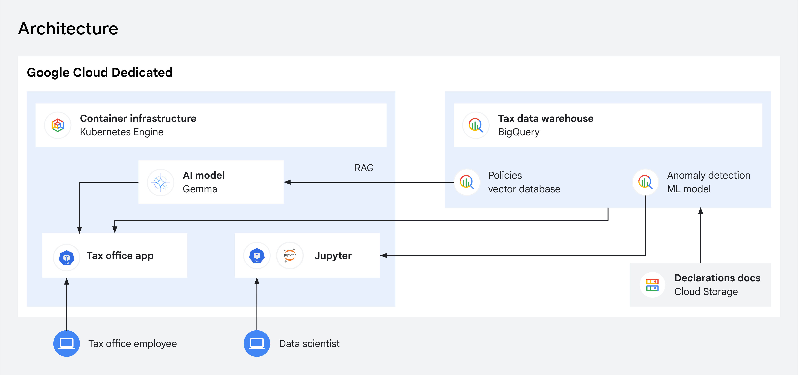

# Tax Anomaly Detection with BigQuery ML & Gemma

## Overview

In the public financial sector, the ability to detect fraud while keeping data
strictly in-country can be a mission-critical requirement.

This solution provides a blueprint for addressing this challenge with Google
Cloud Dedicated. Agencies can deploy BigQuery ML on Google Cloud Dedicated to
analyze millions of tax declarations and identify high-risk anomalies in real
time. Simultaneously, a local, open-weight Gemma RAG system uses vector search
to map those anomalies directly to tax policies. This ensures context-aware
compliance and full auditability, without making external API calls or moving
data outside the sovereign boundary.

**Please note that this is a proof-of-concept prototype built for demonstration
purposes, and the implementation is not audited or secured for production use
cases.**

### Target Audience

This solution is designed for national tax authorities or regulated financial
agencies. It serves the following stakeholders:

- **Auditors & tax investigators** who review real-time dashboards to
  investigate flagged anomalies and use the grounded Gemma AI assistant to
  generate traceable case summaries.
- **Compliance Officers** who centrally manage the system's legal knowledge base
  by uploading and indexing official tax policy documents within a secure, local
  interface.
- **Data Scientists** who securely access raw data using GKE-hosted Jupyter
  environments to iteratively train, validate, and redeploy anomaly detection
  models.

### Core Capabilities

- **Sovereign Anomaly Detection**: Use BigQuery ML to screen massive datasets
  and flag high-risk anomalies instantly, ensuring data never leaves the
  sovereign boundary.
- **Retrieval-Augmented Generation (RAG)**: Run semantic vector searches across
  internal policy libraries to provide grounded, context-aware insights using
  the open-weight Gemma LLM.
- **Localized AI Assistance**: Generate summaries of policy violations through
  an AI assistant running entirely within the regional perimeter.
- **Dynamic Knowledge Management**: Maintain an up-to-date compliance database
  by indexing official regulations as vector embeddings for immediate use in RAG
  pipelines.
- **Dynamic Internationalization**: Instantly switch UI language between
  English, French, and German without reloads or restarts. The new languages can
  be added by including the dictionary at
  `demos/tax-office/app/frontend/static/i18n/`.

### Architecture

This architecture leverages BigQuery ML and a RAG pipeline with Gemma LLM to
deliver secure, context-aware tax anomaly detection.



### Components

The following technologies and Google Cloud Dedicated services are used in this
solution:

| Component    | Tech      | Purpose                                                 |
| :----------- | :-------- | :------------------------------------------------------ |
| **Data**     | Python    | Generate tax data (TRAINING/NEW_FILING).                |
| **Infra**    | Terraform | Provision VPC, GKE, BQ, GCS, Registry.                  |
| **Model**    | BQ ML     | Logistic Regression for anomaly detection.              |
| **LLM**      | Gemma     | Open-weight model for policy-grounded insights.         |
| **RAG**      | BigQuery  | Vector Search for semantic matching and RAG grounding.  |
| **Analysis** | Jupyter   | Notebook for ML model training and analysis/validation. |
| **App**      | Flask     | Web app for prediction visualization.                   |

### Project Structure Overview

This table outlines the main directories within the project repository and their
primary responsibilities.

| Folder        | Description                                 |
| :------------ | :------------------------------------------ |
| **scripts**   | Scripts for deployment and destruction.     |
| **app**       | Frontend, backend, and generator.           |
| **policies**  | Sample policy docs for creating embeddings. |
| **k8s**       | Kubernetes manifest files (Helm charts).    |
| **terraform** | Infrastructure-related Terraform code.      |
| **docs**      | Readme specific files.                      |

## Deploying Tax Anomaly Detection Sample Application

### Prerequisites

1. **Google Cloud Project:** A GCD project with billing enabled.
2. **gcloud CLI:** The Google Cloud SDK installed and authenticated.
3. **Terraform:** Terraform CLI installed.
4. **Docker:** Docker daemon running for image building and pushing. The user
   account executing these operations must have the necessary permissions to
   communicate with the Docker daemon. On Linux systems, this typically means
   the user needs to be a member of the `docker` group.
5. **Python 3:** Python 3.9+ with pip and venv enabled.
6. **kubectl**, **helm** binaries installed.

### Deployment Configuration

Before initiating the deployment process, you must complete the following
critical configuration steps to ensure proper authentication and resource
linking within your Google Cloud Project.

1. Initialize the gcloud CLI for your GCD universe using Workforce Identity
   Federation by following the
   [Google Cloud CLI setup instructions](../../README.md#google-cloud-cli).

2. Enable Cloud Resource Manager API. Ensure the Cloud Resource Manager API is
   explicitly enabled within your GCD Project's console. This is necessary for
   managing project resources.

3. Provide Hugging Face token:

    - The Gemma LLM model is hosted on [Hugging Face](https://huggingface.co/),
      a community platform for sharing machine learning models, datasets, and
      applications. To download the model during deployment, you need an access
      token.
    - **Where to get a token:** Create a free account at
      [huggingface.co](https://huggingface.co/) and generate a **Read** access
      token in your [Settings > Tokens](https://huggingface.co/settings/tokens)
      page.
    - **Model Access:** Before deploying, make sure you have requested and been
      granted access to the
      [Gemma model](https://huggingface.co/google/gemma-3-27b-it) on Hugging
      Face (this typically requires accepting Google's license terms).
    - Once you have the token, update the `hugging_face_token` parameter value
      in the `terraform.tfvars` file with your newly created token in the next
      step.

4. Navigate to `terraform` and update the `terraform.tfvars` file with your
   **mandatory** project-specific values.

    | Variable              | Description                                            |
    | :-------------------- | :----------------------------------------------------- |
    | `project_id`          | Your GCD Project ID.                                   |
    | `region`              | The region for resources (e.g., u-germany-northeast1). |
    | `universe_api_domain` | Sovereign Universe API domain.                         |
    | `data_bucket_name`    | Unique bucket name for demo data.                      |
    | `hugging_face_token`  | Your hugging face token from step 3.                   |
    | `demo_username`       | Username for login to the dashboard.                   |
    | `demo_password`       | Password for login to dashboard and Jupyter Notebook.  |

#### Gemma Model Usage & Deployment

The demo uses the open source [vLLM library](https://docs.vllm.ai/en/stable/) to
automatically download and deploy models via its native Hugging Face
[integration](https://docs.vllm.ai/en/v0.7.0/design/huggingface_integration.html).

##### Data Privacy & Localization

Once the model weights are downloaded, all communication with Hugging Face
servers ceases. All subsequent LLM requests are processed entirely locally
within your environment — no data is ever sent back to external servers. This
setup is optimized for standard demo reliability and security.

##### ​Customizing for Strict Sovereignty

If downloading directly from Hugging Face does not meet your specific data
sovereignty requirements, you can modify the vLLM Kubernetes deployment
configuration located at `k8s/helm/templates/vllm/`. For example, you can:

- ​Pre-download the model to local storage from an approved provider.
- Implement checksum verification to ensure model integrity.
- Update the Helm templates to mount and point vLLM to your localized storage.

### Deployment Scripts

The entire pipeline is orchestrated by a set of shell scripts located in the
`scripts` directory.

#### Full Deployment

The `full_deploy.sh` script handles the entire workflow: data generation,
infrastructure, image build/push, and application deployment.

```bash
# Run the full deployment script
./scripts/full_deploy.sh
```

Upon completion, the script will output the external IP addresses for the **Tax
Office Dashboard** and the **Jupyter Notebook**.

> IMPORTANT:
> 
> **Wait for Deployment:** It may take **~15 minutes** for all pods to be fully
> deployed and ready. The Gemma LLM model deployment, in particular, requires
> significant time to pull and initialize.

#### Standalone Deployment

We have scripts under `scripts/standalone` in case you want to deploy each
component separately. Make sure you run first:

```bash
source scripts/standalone/deploy_infra.sh
```

as it sets necessary environment variables for all other standalone scripts.

## Access and Usage

The web application and Jupyter Notebook are configured with the credentials
that are set in the `terraform.tfvars` file during step 4 of the
[Deployment Configuration](#deployment-configuration). The jupyter notebook only
requires the password, while the dashboard asks for both username and password.

### Restricting Public Access

Once deployment is complete, the public IP addresses for the Jupyter Notebook
and the web app will be displayed.

​⚠️ **Critical Security Note**: By default, no firewall rules or access
restrictions are applied to these GKE endpoints, making them accessible to
anyone on the internet.

​If you plan to leave this demo running long-term, please secure your
environment using one of the following methods:

- **​IP Restriction**: Limit incoming traffic exclusively to your internal IP
  subnets.
- **Private Endpoints**: Reconfigure the GKE services to disable public IP
  exposure entirely.

### Jupyter Notebook

The Jupyter Notebook will be ready once the `full_deploy.sh` script has finished
running or `deploy_app_gke.sh` has finished running in case standalone scripts
are being run:

1. Click the provided **IP address** to open the deployed Jupyter Notebook.
2. Use the credentials (see [Access and Usage](#access-and-usage)) to log in.
3. Once logged in, open `anomaly_detector.ipynb`.
4. From the **Run** menu, select **Run All Cells**.

The notebook will run all cells and automatically create the **Logistic
Regression BQ model** and all related **views**.

### Web App

Once the deployment script completes successfully, you can access the
interactive dashboard using the provided external IP address. Follow this
step-by-step flow to navigate the application and simulate an auditor workflow:

1. **Log In**: Navigate to the Web App URL and log in using previously setup
   credentials (see [Access and Usage](#access-and-usage)). Click **Continue to
   Dashboard** once the secure connection to the Google Cloud Dedicated
   environment is established.
2. **Review Real-Time Anomalies**: The main dashboard displays tax declarations
   scored by the BigQuery ML Logistic Regression engine in real-time. High-risk
   anomalies requiring immediate investigation are highlighted in red.
3. **Analyze a Violation**: Click on a specific flagged anomaly row to activate
   the Policy Violation Engine. The system automatically uses BigQuery Vector
   Search to match the filing against internal tax codes and presents the exact
   policy clause violated along with a semantic similarity score.
4. **Interact with the AI Assistant**: Open the chat console to interact with
   the grounded, open-weights Gemma LLM. Enter a prompt such as `"summarize this
   policy violation for me"` to receive a localized, legally sound case summary
   generated securely within the regional perimeter.
5. **Manage Compliance Documents**: Click on Policies in the top-right corner to
   access the Policy Management Interface. Authorized compliance team members
   can upload, edit, or delete policy documents here, which are instantly
   chunked and indexed as vector embeddings within BigQuery to dynamically
   update the AI's knowledge base.

## Testing with Sample Documents

The repository contains pre-structured configurations to simulate both incoming
taxpayer records and official legal frameworks. Testing your deployment involves
verifying how these two data sources interact.

### 1. Generating Sample Tax Declarations

You do not need to manually upload mock taxpayer filings. The automated
deployment pipeline (`full_deploy.sh`) automatically runs a Python generator
script (`app/data_generator`) to produce mock taxpayer records (`TRAINING` and
`NEW_FILING` datasets) and ingest them directly into BigQuery.

To verify these sample filings are present, you can look at the interactive web
app dashboard, which pulls rows of live-scored declarations directly from this
generated dataset.

### 2. Uploading Sample Policy Documents

To test how the system matches those sample filings against internal
regulations, you must manually populate the knowledge base with your own policy
files or the provided examples:

1. Log into the Web App dashboard using your credentials (see
   [Access and Usage](#access-and-usage)) and click on **Policies** in the
   top-right corner.
2. Click on **Select files to upload**.
3. Navigate to your local copy of the repository, open the `policies/`
   directory, select one of the provided tax policy files, and click **Open**.
   You can also upload your own tax policy files, however make sure that these
   are text (UTF-8 encoded) files, not in PDF, HTML, or Word documents.
4. The system will instantly chunk the document and calculate semantic vector
   embeddings natively inside BigQuery.

### 3. Validating the End-to-End Match

Once both data sources exist in BigQuery, you can validate the integration:

1. Return to the main dashboard and click on a high-risk anomaly row
   (*highlighted in red*).
2. Verify that the Policy Violation Engine successfully calculates a semantic
   match between the specific data in that mock tax declaration and the text
   chunks from your uploaded policy file.
3. Open the AI Assistant chat box and ask the model to analyze the match (e.g.,
   `"summarize this policy violation for me"`) to confirm that the local Gemma
   LLM is successfully reading the data and policy context within the regional
   perimeter.

## Cleanup

To destroy all cloud resources created by Terraform (GKE, VPC, BigQuery, GCS,
Artifact Registry) and clean up local data artifacts, run the destroy script.

​⚠️ **This action is irreversible.**

```bash
# Run the full destruction script
./scripts/full_destroy.sh
```

## Troubleshooting

### Terraform Destroy Failures

Occasionally, the `full_destroy.sh` script may fail during the Terraform
destruction phase with an error similar to:

```none
Error: Error waiting for Deleting Network: The network resource '...' is
already being used by '.../networkEndpointGroups/...'
```

This happens when GKE Network Endpoint Groups (NEGs) or VPC routes created by
Kubernetes Ingress resources are not fully deprovisioned by the Google Cloud
controller before Terraform attempts to delete the network.

**Solution:**

1. Manually delete the offending Network Endpoint Groups (NEGs) in the Google
   Cloud Console or using the `gcloud` CLI.
2. Once the NEGs are removed, re-run the `full_destroy.sh` script to complete
   the cleanup.

---

```
Copyright 2026 Google LLC

Licensed under the Apache License, Version 2.0 (the "License");
you may not use this file except in compliance with the License.
You may obtain a copy of the License at

    https://www.apache.org/licenses/LICENSE-2.0


Unless required by applicable law or agreed to in writing, software
distributed under the License is distributed on an "AS IS" BASIS,
WITHOUT WARRANTIES OR CONDITIONS OF ANY KIND, either express or implied.
See the License for the specific language governing permissions and
limitations under the License.
```
