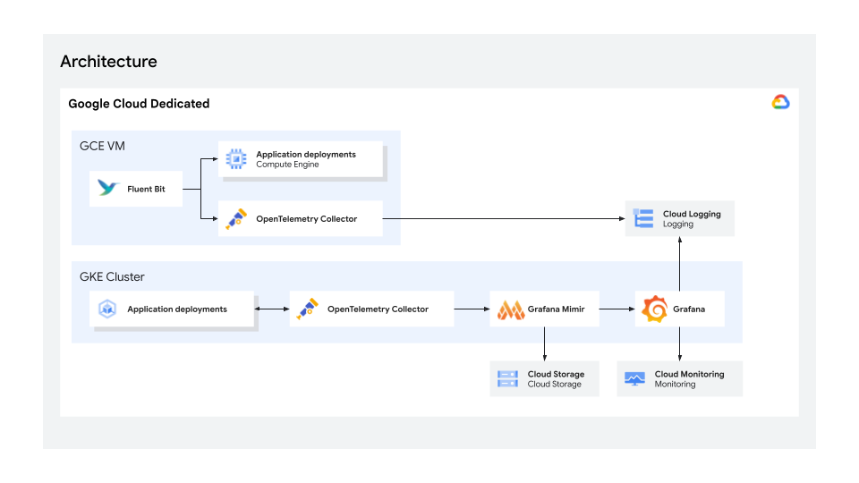

# OSS-based Monitoring Solution

## Overview

This sample application demonstrates how to implement an open-source (OSS)
observability and monitoring stack on Google Cloud Dedicated (GCD). By deploying
OpenTelemetry, Grafana Mimir (backed by GCS), Grafana Loki (backed by GCS), Grafana, and Fluent Bit on GKE and
GCE, this reference architecture enables metric collection, log ingestion,
visualization, and alerting within sovereign cloud perimeters.

**Please note that this is a proof-of-concept prototype built for demonstration
purposes, and the implementation is not audited, hardened, or secured for
production use cases.**

### Target Audience

This solution is designed for cloud SREs, observability engineers, security
officers, and enterprise architects. It serves the following stakeholders:

-   **Site Reliability Engineers (SREs) & DevOps Leaders**: Provisions
    automated, scalable metrics storage (Mimir + GCS) and log pipelines (Loki + Fluent
    Bit) to monitor application health and track system SLAs without manual
    exporter maintenance.
-   **Compliance & Security Officers**: Guarantees that sensitive application
    logs, metrics, and operational signals remain 100% localized within
    sovereign boundary storage (GCS), avoiding non-sovereign SaaS data outflow.
-   **Enterprise Cloud Architects**: Establishes a standardized OpenTelemetry
    foundation that unblocks immediate cloud migrations while ensuring a smooth
    transition path to native Cloud Monitoring.

### Core Capabilities

-   **Sovereign Observability & Local Data Retention**: Collects, processes, and
    stores application metrics and GCE/GKE logs entirely within local sovereign
    infrastructure and GCS buckets.
-   **OpenTelemetry Standard Ingestion**: Employs OpenTelemetry Collectors for
    pull-based Prometheus scraping and push-based OTLP metrics and logs ingestion,
    guaranteeing future compatibility with native 1P Cloud Monitoring.
-   **Scalable GCS-Backed Metric & Log Storage**: Leverages Grafana Mimir and Grafana Loki configured
    with Google Cloud Storage (GCS) as high-availability, cost-effective
    Prometheus metric and log chunk backends.
-   **Unified Telemetry Visualization**: Pre-configured Grafana dashboards
    displaying real-time application metrics, Loki log streams, GCE VM stdout logs, and integrated
    Cloud Logging datasources.
-   **GCE VM Logging Pipeline**: Automated installer for standalone Compute
    Engine VMs deploying Fluent Bit and OpenTelemetry Collector Contrib to
    stream `systemd-journald` and stdout logs to Cloud Logging and Loki.
-   **Flexible Deployment Automation**: Complete Infrastructure-as-Code
    (Terraform) and Kubernetes packaging (Helm) for one-command environment
    setup and teardown.

### Architecture

This architecture deploys OpenTelemetry Collectors, Grafana Mimir, Grafana Loki, and Grafana
on GKE, backed by Google Cloud Storage for metric and log retention and Cloud Logging
for centralized log management.



### Components

Component                    | Tech                       | Purpose
:--------------------------- | :------------------------- | :------
**Telemetry Collector**      | OpenTelemetry Collector    | Central telemetry pipeline processing OTLP HTTP/gRPC metrics & logs, scraping Prometheus endpoints, and forwarding to Mimir and Loki.
**Metrics Database**         | Grafana Mimir              | Highly available, long-term Prometheus metric storage database persisting blocks in GCS.
**Logs Database**            | Grafana Loki               | Horizontally scalable, multi-tenant log aggregation database persisting chunks and TSDB indexes in GCS.
**Object Storage**           | Google Cloud Storage (GCS) | Secure, durable object storage backend retaining Mimir metric blocks and Loki log chunks cost-effectively.
**GKE Log Collector**        | Fluent Bit (DaemonSet)     | Collects container stdout logs across GKE nodes (`/var/log/containers/*.log`), enriches with K8s metadata, and forwards via OTLP mTLS to OTel Collector.
**VM Log Collector**         | Fluent Bit & OTel Contrib  | Collects OS and application stdout logs on standalone GCE VMs via `systemd-journald` and streams to Cloud Logging.
**Central Logging**          | Cloud Logging              | Native centralized logging sink for GCE VM and platform logs.
**Visualization & Alerting** | Grafana                    | Dashboard visualization layer pre-configured with datasources for Mimir, Loki, Cloud Monitoring, and Cloud Logging.
**Push Demo App**            | Python (Beacon App)        | Demo microservice emitting synthetic OTLP metrics pushed to OTel Collector every 5 seconds.
**Pull Demo App**            | Python (Sensor App)        | Demo microservice exposing standard `/metrics` Prometheus endpoint scraped by OTel Collector.
**GCE Demo Log App**         | Python (GCE Demo App)      | Demo application running on GCE VMs producing structured JSON logs to stdout.
**Provisioning**             | Terraform & Helm           | Automates GCD VPC, GKE cluster, GCS bucket, IAM roles, GCE VM, and Helm chart deployment.

### Project Structure Overview

This table outlines the main directories within the project repository and their
primary responsibilities.

Folder         | Description
:------------- | :----------
**k8s/helm/**  | Kubernetes Helm charts for Grafana, Mimir, Loki, OpenTelemetry Collector, Fluent Bit, cert-manager, and demo applications.
**terraform/** | Infrastructure-as-Code files (`main.tf`, `variables.tf`, `defaults.yaml.example`) for VPC, GKE, GCS, IAM, and GCE.
**scripts/**   | Deployment scripts (`full_deploy.sh`, `full_destroy.sh`), modular standalone scripts (`scripts/standalone/`), and GCE VM installer (`scripts/gce/`).
**docs/**      | Architecture diagrams and user guide documentation assets.


## Disclaimer

> [!IMPORTANT] **Proof-of-Concept & Reference Implementation Only**
>
> This demonstration is designed strictly as an open-source reference
> architecture to demonstrate observability patterns on Google Cloud Dedicated.
> It is **not audited, hardened, or certified for production deployment**.

### Operational & Security Assumptions

-   **User Authentication**: Default username/password authentication in Grafana
    is disabled by default and must be properly configured for enterprise use.
    Integration placeholders for Keycloak / OAuth SSO are provided; customers
    are responsible for configuring their identity provider before production
    exposure.
-   **TLS & Certificate Authority**: Internal service-to-service communication
    relies on certificates issued by a local `cert-manager` CA. Customer
    applications running in the cluster will not trust this internal CA by
    default. Production deployments must integrate a trusted enterprise
    Certificate Authority (CA).
-   **Network Access & Firewalling**: Grafana dashboard access is exposed over
    Public IP using TLS certificates issued by `cert-manager`. Customers are
    responsible for configuring proper load balancing, Web Application Firewalls
    (WAF), and VPC firewall rules.
-   **Operational Ownership**: Google provides open-source reference scripts and
    vulnerability patches. Day-2 operations, cluster scaling, monitoring upkeep,
    and security hardening are the exclusive operational responsibility of the
    customer.

--------------------------------------------------------------------------------

## Deployment

### Prerequisites

Name                      | Version | Notes
------------------------- | ------- | -----
Google Cloud SDK (gcloud) | Latest  | Used for authentication and resource management.
Terraform                 | >= 1.0  | Required to provision the underlying GCD infrastructure.
Helm                      | Latest  | Install the latest version from Helm's official installation guide.
Python                    | 3.x     | Required to manually run demo apps.
Docker                    | Latest  | Required to build and push the demo application container images.

### Steps

#### 1. Authenticate

Before running any deployment scripts, authenticate using your Workforce
Identity Federation(WIF) login to the organization with the configured IdP. If
you don't have one please refer to
[README.md](../../README.md#google-cloud-cli).

#### 2. Configure the Environment

Create your configuration file at `terraform/defaults.yaml`. You can make use of
`terraform/defaults.yaml.example`

##### Standard Deployment

Terraform provisions the complete infrastructure stack from scratch. The minimum
parameters are:

Variable                      | Requirement              | Description
----------------------------- | ------------------------ | -----------
terraform.project_id          | `Required`               | GCD Project ID including universe prefix.
terraform.region              | `Required`               | GCD Region where resources are deployed (e.g., `u-france-east1`).
terraform.universe_api_domain | `Required`               | Sovereign Cloud API domain (e.g., `s3nsapis.fr`).
grafana.admin_user            | `Required`               | Admin username for Grafana dashboard.
grafana.admin_password        | `Required`               | Admin password for Grafana dashboard.
grafana.oauth.client_id       | **`Required` for OAuth** | Client ID from your IAM solution.
grafana.oauth.client_secret   | **`Required` for OAuth** | Client Secret from your IAM solution.
grafana.oauth.provider_url    | **`Required` for OAuth** | Base URL of your IAM solution (e.g., `https://keycloak.example.com/auth/realm/sample`).

> **Note**: This demo utilizes Keycloak for identity and access management
> (IAM). For comprehensive setup instructions, refer to the official
> [Grafana Keycloak Documentation](https://grafana.com/docs/grafana/latest/setup-grafana/configure-access/configure-authentication/keycloak/)
> and the
> [Keycloak Getting Started guide](https://www.keycloak.org/guides#getting-started).

##### Advanced Overrides

Advanced users can optionally override container image paths, customize
infrastructure parameters independently or disable components. :

Variable                           | Description                                                                                                                                                                           | Default Auto-Derived Fallback
---------------------------------- | ------------------------------------------------------------------------------------------------------------------------------------------------------------------------------------- | -----------------------------
terraform.resources_prefix         | `Optional` Prefix used to generate resource names (`monitoring-vpc`, `monitoring-cluster`, `monitoring-storage`, etc.).                                | `"monitoring"`
terraform.k8s_namespace            | `Optional` Target Kubernetes namespace.                                                                                                                                               | `"monitoring-ns"`
terraform.services                 | `Optional` List of GCD APIs to enable on project.                                                                                                                                     | Standard monitoring GCD service list
terraform.enable_gke               | `Optional (default: true)` Enable/disable GKE cluster provisioning.                                                                                   | When `true` creates GKE cluster `${resources_prefix}-cluster`.
terraform.gke_name                 | `Optional` Custom GKE cluster name when reusing existing cluster (`enable_gke: false`).                                                                                              | `${resources_prefix}-cluster`
terraform.vpc_name                 | `Optional` Custom VPC network name when reusing existing network.                                                                                                                     | `${resources_prefix}-vpc`
terraform.subnet_name              | `Optional` Custom Subnetwork name when reusing existing network.                                                                                                                      | `${resources_prefix}-subnet`
terraform.enable_storage_bucket    | `Optional (default: true)` Enable/disable GCS bucket provisioning.                                                                                     | When `true` creates GCS bucket `${resources_prefix}-storage`.
terraform.storage_bucket_name      | `Optional` Custom GCS bucket name when reusing existing bucket (`enable_storage_bucket: false`).                                                                                     | `${resources_prefix}-storage`
terraform.enable_artifact_registry | `Optional (default: true)` Enable/disable Artifact Registry repository provisioning.                                                                  | When `true` creates Artifact Registry `${resources_prefix}-registry`.
terraform.artifact_registry_uri    | **`Required` if `enable_artifact_registry: false`** Full URI of existing Artifact Registry repository to reuse.                                        | `null`
grafana.disable_login_form         | `Optional` Disable local login form (`true` or `false`). Defaults to `true`.                                                                          | `true`
grafana.oauth.enable               | `Optional` Enable OAuth SSO authentication (`true` or `false`). Defaults to `true`.                                                                   | `true`
gce.enabled                        | `Optional (default: true)` Enable/disable standalone GCE VM provisioning (`true` or `false`).                                                         | `true`
gce.enable_demo_log_generator      | `Optional (default: true)` Enable synthetic JSON stdout demo log generator on VM (`true` or `false`).                                                | `true`
gce.machine_type                   | `Optional` Custom machine type for GCE VM.                                                                                                            | `"c3-standard-4"` (Sovereign Cloud) / `"e2-medium"`
gce.image                          | `Optional` Custom boot disk image for GCE VM.                                                                                                         | `"${project_prefix}-system:debian-cloud/debian-12"` (Sovereign Cloud)

#### 3. (Optional) Disable default components

Disabling a component disables Terraform creation of that resource. The installer automatically defaults to prefix-derived names (`${resources_prefix}-cluster`, `${resources_prefix}-storage`), but allows you to specify custom names if your existing resources use non-standard names.

##### GKE

```yaml
terraform:
  ...
  enable_gke: false
  # gke_name: custom-cluster   # Optional: specify if your existing cluster is not named ${resources_prefix}-cluster
  # vpc_name: custom-vpc       # Optional: specify if your existing VPC is not named ${resources_prefix}-vpc
  # subnet_name: custom-subnet # Optional: specify if your existing subnet is not named ${resources_prefix}-subnet
```

##### Storage Bucket

When `enable_storage_bucket` is set to `false`, the GCS bucket creation in `gcs.tf` is skipped, allowing you to reuse an existing bucket specified by `storage_bucket_name`. The Mimir and Loki service accounts and their IAM bindings are still configured to grant the necessary object storage access.

```yaml
terraform:
  ...
  enable_storage_bucket: false
  # storage_bucket_name: custom-bucket # Optional: specify if your existing bucket is not named ${resources_prefix}-storage
```

##### Artifact Registry

```yaml
terraform:
  ...
  enable_artifact_registry: false
  artifact_registry_uri: docker.pkg-berlin-build0.goog/eu0/my-project/my-registry # Full URI of your custom artifact registry
```

#### 4. Deploy Infrastructure & Stack

Once `./terraform/defaults.yaml` is configured, launch the automated full deployment:

```bash
# Using Just command runner:
just install

# Or running script directly:
./scripts/full_deploy.sh
```

##### Standalone Deployment Options

Each deployment stage can also be executed independently:

```bash
# 1. Provision GCP Infrastructure (Terraform):
./scripts/standalone/deploy_infra.sh   # or 'just deploy-infra'

# 2. Build and push demo apps container images to Artifact Registry:
./scripts/standalone/deploy_images.sh  # or 'just deploy-images'

# 3. Deploy GKE monitoring stack and demo applications:
./scripts/standalone/deploy_app_gke.sh # or 'just deploy-app-gke'
```


#### 5. Cleanup

To completely tear down the GKE deployments and destroy all the GCD infrastructure resources:

```bash
# Using Just command runner:
just uninstall

# Or running script directly:
./scripts/full_destroy.sh
```

##### Standalone Cleanup Options

You can also tear down specific layers of the deployment independently:

```bash
# 1. Destroy GKE monitoring stack and demo applications only:
./scripts/standalone/destroy_app_gke.sh # or 'just destroy-app-gke'

# 2. Destroy Terraform infrastructure:
./scripts/standalone/destroy_infra.sh   # or 'just destroy-infra'
```


--------------------------------------------------------------------------------

## Standalone GCE VM Monitoring (Existing VMs)

If you already have existing GCE Virtual Machines and want to manually install
the OpenTelemetry Collector and Fluent Bit logging pipeline, follow the
instructions below.

### Prerequisites

1.  **User Privileges (`sudo` Access)**: The user running the installation
    script must have `sudo` or root privileges.
2.  **Outbound Internet Connectivity**: The VM must have outbound internet
    connectivity (via Public IP or Cloud NAT) to download packages from
    Debian/Ubuntu repositories, `packages.fluentbit.io`, and GitHub releases.
3.  **GCE Metadata & Attached Service Account (ADC)**: The VM must have an
    attached Service Account with the Logs Writer role
    (`roles/logging.logWriter`) and an access scope that includes
    `cloud-platform` or `logging.write`.
4.  **Private Google Access**: If the VM has no external public IP, Private
    Google Access must be enabled on the VPC subnet to reach Google Cloud APIs.
5.  **Operating System Support**: Linux distribution with `systemd-journald` and
    Debian/Ubuntu package management (`apt`), such as Debian 11/12/13 or Ubuntu
    20.04/22.04/24.04/26.04.
6.  **Google Cloud Storage Access**: The VM attached service account needs to
    have access to the bucket storage (`roles/storage.objectViewer`).

### Installation Steps

#### Step 1: Copy Configuration Directory to the VM

Copy the `scripts/gce` folder to your target VM.

#### Step 2: (Optional) Copy Demo App Directory to the VM

If you plan to run the synthetic verification app, copy the `apps/gce-demo-app`
folder to the **same parent directory** where `gce/` is located on the VM.

#### Step 3: Run the Installation Script

Navigate to the directory where the script is located (or provide its path) and
execute with `sudo`:

-   **a) Standard installation (without demo app):**

    ```bash
    sudo UNIVERSE_DOMAIN="<UNIVERSE-API-DOMAIN>" <PATH-TO-SCRIPT>/install-vm-monitoring.sh
    ```

-   **b) With demo log generator app enabled:**

    ```bash
    sudo UNIVERSE_DOMAIN="<UNIVERSE-API-DOMAIN>" ENABLE_DEMO_LOG_GENERATOR="true" <PATH-TO-SCRIPT>/install-vm-monitoring.sh
    ```

#### Step 4: Verify Service Status

Check that the logging services are active and running:

```bash
sudo systemctl status fluent-bit otelcol-contrib
```

*(If the demo app was enabled, also verify `sudo systemctl status
vm-demo-app.service`).*

--------------------------------------------------------------------------------

## Troubleshooting

### Unable to run terraform apply

**Solution**: Verify your active credentials. Ensure your exact user account has
the necessary IAM permissions on the target GCD project. If not, add your user
to the project IAM policy.

### Corrupt Terraform state

**Solution**: If your local Terraform state becomes corrupted or out of sync,
remove your terraform folder and any terraform related file and start over:

```bash
# Clean cache and local state configurations safely
rm -rf .terraform/
rm -f .terraform.lock.hcl
rm -f terraform.tfstate terraform.tfstate.backup
# rerun full deploy script
./scripts/full_deploy.sh
```

### Docker / Image Pull errors on GKE

**Solution**: Ensure that the GKE Service Account has the
`roles/artifactregistry.reader` role assigned to read from your Artifact
Registry repository.

### Deploy is not working / Resources in inconsistent state

**Solution**: Try running `./scripts/full_destroy.sh` to destroy all resources. If
any resources remain, delete them manually via the Console.

### Cluster deployment takes a long time

GKE cluster for this demo can take between 10 to 20 minutes to fully provision
and bootstrap. Please be patient and monitor progress via terminal or the Google
Cloud Dedicated Console UI.

### I want to see all components installed

**Solution**: Run `terraform state list` to see all installed components:

```bash
terraform state list
```

---

```
Copyright 2026 Google LLC

Licensed under the Apache License, Version 2.0 (the "License");
you may not use this file except in compliance with the License.
You may obtain a copy of the License at

    https://www.apache.org/licenses/LICENSE-2.0


Unless required by applicable law or agreed to in writing, software
distributed under the License is distributed on an "AS IS" BASIS,
WITHOUT WARRANTIES OR CONDITIONS OF ANY KIND, either express or implied.
See the License for the specific language governing permissions and
limitations under the License.
```
