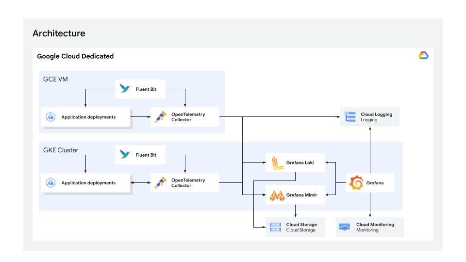

# OSS-based Monitoring Solution

## Overview

This sample application demonstrates how to implement an open-source (OSS)
observability and monitoring stack on Google Cloud Dedicated (GCD). By deploying
OpenTelemetry, Grafana Mimir (backed by GCS), Grafana Loki (backed by GCS),
Grafana, and Fluent Bit on GKE and GCE, this reference architecture enables
metric collection, log ingestion, visualization, and alerting within sovereign
cloud perimeters.

**Please note that this is a proof-of-concept prototype built for demonstration
purposes, and the implementation is not audited, hardened, or secured for
production use cases.**

### Target Audience

This solution is designed for cloud SREs, observability engineers, security
officers, and enterprise architects. It serves the following stakeholders:

-   **Site Reliability Engineers (SREs) & DevOps Leaders**: Provisions
    automated, scalable metrics storage (Mimir + GCS) and log pipelines (Loki +
    Fluent Bit) to monitor application health and track system SLAs without
    manual exporter maintenance.
-   **Compliance & Security Officers**: Guarantees that sensitive application
    logs, metrics, and operational signals remain 100% localized within
    sovereign boundary storage (GCS), avoiding non-sovereign SaaS data outflow.
-   **Enterprise Cloud Architects**: Establishes a standardized OpenTelemetry
    foundation that unblocks immediate cloud migrations while ensuring a smooth
    transition path to native Cloud Monitoring.

### Core Capabilities

-   **Sovereign Observability & Local Data Retention**: Collects, processes, and
    stores application metrics and GCE/GKE logs entirely within local sovereign
    infrastructure and GCS buckets.
-   **OpenTelemetry Standard Ingestion**: Employs OpenTelemetry Collectors for
    pull-based Prometheus scraping and push-based OTLP metrics and logs
    ingestion, guaranteeing future compatibility with native 1P Cloud
    Monitoring.
-   **Scalable GCS-Backed Metric & Log Storage**: Leverages Grafana Mimir and
    Grafana Loki configured with Google Cloud Storage (GCS) as
    high-availability, cost-effective Prometheus metric and log chunk backends.
-   **Unified Telemetry Visualization**: Pre-configured Grafana dashboards
    displaying real-time application metrics, Loki log streams, GCE VM host
    metrics and stdout logs, integrated Cloud Monitoring and Cloud Logging
    datasources, and sample alerting rules.
-   **GCE VM Logging & Metrics Pipeline**: Automated installer for standalone
    Compute Engine VMs deploying Fluent Bit and OpenTelemetry Collector Contrib
    to stream `systemd-journald` and stdout logs to Loki, Cloud Logging, or both
    (double logging), while collecting VM host metrics (`hostmetrics`) and
    synthetic OTLP application metrics to forward over mTLS to Mimir.
-   **Flexible Deployment Automation**: Complete Infrastructure-as-Code
    (Terraform) and Kubernetes packaging (Helm) for one-command environment
    setup and teardown.

### Architecture

This architecture deploys OpenTelemetry Operator and Collectors, Grafana Mimir,
Grafana Loki, `kube-state-metrics`, Fluent Bit, `cert-manager`, and Grafana on a
private GKE Autopilot cluster, backed by Google Cloud Storage for metric and log
retention and Cloud Logging for centralized log management. Mimir and Loki
gateways are exposed internally within the VPC via internal LoadBalancers over
mTLS so standalone GCE VMs can push metrics and logs directly, while Grafana is
exposed externally over HTTPS via a regional GKE Gateway.



### Components

Component                    | Tech                                | Purpose
:--------------------------- | :---------------------------------- | :------
**Telemetry Collector**      | OpenTelemetry Operator & Collector  | Central telemetry pipeline processing OTLP HTTP/gRPC metrics & logs over mTLS, scraping Prometheus endpoints (all `ServiceMonitor` resources with the label `release: monitoring`), transforming K8s log attributes, and forwarding to Mimir and Loki.
**Metrics Database**         | Grafana Mimir                       | Highly available, long-term Prometheus metric storage database persisting blocks and ruler rules in GCS.
**Logs Database**            | Grafana Loki                        | Horizontally scalable, multi-tenant log aggregation database persisting chunks and TSDB indexes in GCS.
**Object Storage**           | Google Cloud Storage (GCS)          | Provisions dedicated buckets for Mimir metrics, Loki logs, and shared monitoring artifacts.
**Cluster State Metrics**    | `kube-state-metrics`                | Listens to the Kubernetes API server and generates metrics about the state of cluster objects (deployments, nodes, pods), scraped by the OpenTelemetry Collector via `ServiceMonitor`.
**PKI & Certificates**       | `cert-manager` & PKI Issuer         | Bootstraps an internal Root CA and `ClusterIssuer` to issue TLS/mTLS certificates for in-cluster components and standalone GCE VMs.
**GKE Log Collector**        | Fluent Bit (DaemonSet)              | Collects container stdout logs across GKE nodes, enriches with K8s metadata, and forwards via OTLP mTLS to the GKE OTel Collector.
**VM Telemetry Collector**   | Fluent Bit & OTel Collector Contrib | Collects OS and application stdout logs on standalone GCE VMs via `systemd-journald` (streaming to Loki, Cloud Logging, or both) as well as VM `hostmetrics` and OTLP metrics (forwarded over mTLS to Mimir).
**Central Logging**          | Cloud Logging                       | Native centralized logging sink for GKE system/workload logs and GCE VM logs (supports single or double logging alongside Loki).
**Visualization & Alerting** | Grafana                             | Dashboard visualization and alerting layer pre-configured with datasources for Mimir, Loki, Cloud Monitoring, and Cloud Logging, some dashboards, and sample alerting rules.
**Push Demo App**            | Python (Beacon App)                 | Demo microservice emitting synthetic OTLP metrics pushed to the OTel Collector every 5 seconds.
**Pull Demo App**            | Python (Sensor App)                 | Demo microservice exposing an HTTPS/mTLS `/metrics` Prometheus endpoint scraped by the GKE OTel Collector via `ServiceMonitor`.
**GCE Demo Log App**         | Python (Fountain App)               | Demo application running on GCE VMs producing structured JSON logs to stdout every 10 seconds.
**GCE Demo Metric App**      | Python (Beacon App)                 | Demo application running as a `systemd` service on GCE VMs pushing synthetic OTLP metrics to the local OTel Collector every 5 seconds.
**Provisioning**             | Terraform, Helm & Just              | Automates GCD VPC, Cloud Router/NAT, GKE Autopilot cluster, GCS buckets, Artifact Registry, IAM Workload Identity bindings, GCE VM, and Helm chart deployments.

### Project Structure Overview

This table outlines the main directories within the project repository and their
primary responsibilities.

Folder / File  | Description
:------------- | :----------
**apps/**      | Python demo applications and unit tests: `beacon/` (OTLP push metrics), `sensor/` (Prometheus pull metrics), `fountain/` (GCE stdout JSON log generator), and `gce/` (`systemd` service units).
**k8s/helm/**  | Kubernetes Helm wrapper charts for `grafana-wrapper`, `mimir-wrapper`, `loki-wrapper`, `opentelemetry-wrapper`, `fluent-bit-wrapper`, `kube-state-metrics-wrapper`, `cert-manager-wrapper`, `pki`, and demo `apps/`.
**terraform/** | Infrastructure-as-Code files for VPC, GKE, GCS, Artifact Registry, IAM, and GCE.
**scripts/**   | Deployment scripts, modular standalone scripts, and GCE VM installer and configs.
**docs/**      | Architecture diagrams and user guide documentation assets.

## Disclaimer

> [!IMPORTANT] **Proof-of-Concept & Reference Implementation Only**
>
> This demonstration is designed strictly as an open-source reference
> architecture to demonstrate observability patterns on Google Cloud Dedicated.
> It is **not audited, hardened, or certified for production deployment**.

### Operational & Security Assumptions

-   **User Authentication**: Default username/password authentication in Grafana
    is disabled by default and must be properly configured for enterprise use.
    Integration placeholders for Keycloak / OAuth SSO are provided; customers
    are responsible for configuring their identity provider before production
    exposure.
-   **TLS & Certificate Authority**: Internal service-to-service communication
    relies on certificates issued by a local `cert-manager` CA. Customer
    applications running in the cluster will not trust this internal CA by
    default. Production deployments must integrate a trusted enterprise
    Certificate Authority (CA).
-   **Network Access & Firewalling**: Grafana dashboard access is exposed over
    Public IP using TLS certificates issued by `cert-manager`. Customers are
    responsible for configuring proper load balancing, Web Application Firewalls
    (WAF), and VPC firewall rules.
-   **Operational Ownership**: Google provides open-source reference scripts and
    vulnerability patches. Day-2 operations, cluster scaling, monitoring upkeep,
    and security hardening are the exclusive operational responsibility of the
    customer.

--------------------------------------------------------------------------------

## Deployment

### Prerequisites

Name                      | Version | Notes
------------------------- | ------- | -----
Google Cloud SDK (gcloud) | Latest  | Used for authentication, GKE credentials, and resource management.
Terraform                 | >= 1.0  | Required to provision the underlying GCD infrastructure.
kubectl                   | Latest  | Required to manage GKE cluster resources, certificates, and gateways.
Helm                      | Latest  | Install the latest version from Helm's official installation guide.
Python                    | 3.x     | Required to parse `defaults.yaml` during deployment and manually run demo apps.
Docker                    | Latest  | Required to build and push the demo application container images.

### Steps

#### 1. Authenticate

Before running any deployment scripts, authenticate using your Workforce
Identity Federation(WIF) login to the organization with the configured IdP. If
you don't have one please refer to
[README.md](../../README.md#google-cloud-cli).

#### 2. Configure the Environment

Create your configuration file at `terraform/defaults.yaml`. You can make use of
`terraform/defaults.yaml.example`

##### Standard Deployment

Terraform provisions the complete infrastructure stack from scratch. The minimum
parameters are:

Variable                      | Requirement              | Description
----------------------------- | ------------------------ | -----------
terraform.project_id          | `Required`               | GCD Project ID including universe prefix.
terraform.region              | `Required`               | GCD Region where resources are deployed (e.g., `u-france-east1`).
terraform.universe_api_domain | `Required`               | Sovereign Cloud API domain (e.g., `s3nsapis.fr`).
grafana.admin_user            | `Required`               | Admin username for Grafana dashboard.
grafana.admin_password        | `Required`               | Admin password for Grafana dashboard.
grafana.oauth.client_id       | **`Required` for OAuth** | Client ID from your IAM solution.
grafana.oauth.client_secret   | **`Required` for OAuth** | Client Secret from your IAM solution.
grafana.oauth.provider_url    | **`Required` for OAuth** | Base URL of your IAM solution (e.g., `https://keycloak.example.com/auth/realm/sample`).

> **Note**: This demo utilizes Keycloak for identity and access management
> (IAM). For comprehensive setup instructions, refer to the official
> [Grafana Keycloak Documentation](https://grafana.com/docs/grafana/latest/setup-grafana/configure-access/configure-authentication/keycloak/)
> and the
> [Keycloak Getting Started guide](https://www.keycloak.org/guides#getting-started).

##### Advanced Overrides

Advanced users can optionally override container image paths, customize
infrastructure parameters independently or disable components. :

Variable                           | Description                                                                                                                                    | Default Auto-Derived Fallback
---------------------------------- | ---------------------------------------------------------------------------------------------------------------------------------------------- | -----------------------------
terraform.resources_prefix         | `Optional` Prefix used to generate resource names (`monitoring-vpc`, `monitoring-cluster`, `monitoring-storage`, etc.).                        | `"monitoring"`
terraform.k8s_namespace            | `Optional` Target Kubernetes namespace.                                                                                                        | `"monitoring-ns"`
terraform.services                 | `Optional` List of GCD APIs to enable on project.                                                                                              | Standard monitoring GCD service list
terraform.enable_gke               | `Optional (default: true)` Enable/disable GKE cluster provisioning.                                                                            | When `true` creates GKE cluster `${resources_prefix}-cluster`.
terraform.gke_name                 | `Optional` Custom GKE cluster name when reusing existing cluster (`enable_gke: false`).                                                        | `${resources_prefix}-cluster`
terraform.vpc_name                 | `Optional` Custom VPC network name when reusing existing network.                                                                              | `${resources_prefix}-vpc`
terraform.subnet_name              | `Optional` Custom Subnetwork name when reusing existing network.                                                                               | `${resources_prefix}-subnet`
terraform.enable_storage_bucket    | `Optional (default: true)` Enable/disable GCS bucket provisioning.                                                                             | When `true` creates GCS buckets `${resources_prefix}-storage`, `${resources_prefix}-mimir-storage`, and `${resources_prefix}-loki-storage`.
terraform.storage_bucket_name      | `Optional` Custom GCS bucket name for VM certificates and Fluent Bit package.                                                                  | `${resources_prefix}-storage`
terraform.mimir_bucket_name        | `Optional` Custom GCS bucket name for Mimir metrics storage.                                                                                   | `${resources_prefix}-mimir-storage`
terraform.loki_bucket_name         | `Optional` Custom GCS bucket name for Loki logs storage.                                                                                       | `${resources_prefix}-loki-storage`
terraform.enable_artifact_registry | `Optional (default: true)` Enable/disable Artifact Registry repository provisioning.                                                           | When `true` creates Artifact Registry `${resources_prefix}-registry`.
terraform.artifact_registry_uri    | **`Required` if `enable_artifact_registry: false`** Full URI of existing Artifact Registry repository to reuse.                                | `null`
grafana.disable_login_form         | `Optional` Disable local login form (`true` or `false`). Defaults to `true`.                                                                   | `true`
grafana.oauth.enable               | `Optional` Enable OAuth SSO authentication (`true` or `false`). Defaults to `true`.                                                            | `true`
gce.enabled                        | `Optional (default: true)` Enable/disable standalone GCE VM provisioning (`true` or `false`).                                                  | `true`
gce.enable_demo_log_generator      | `Optional (default: true)` Enable synthetic JSON stdout demo log generator on VM (`true` or `false`).                                          | `true`
gce.enable_demo_metric_generator   | `Optional (default: true)` Enable synthetic OTLP demo metric generator (Beacon app) on VM (`true` or `false`).                                 | `true`
gce.machine_type                   | `Optional` Custom machine type for GCE VM.                                                                                                     | `"c3-standard-4"` (Sovereign Cloud) / `"e2-medium"`
gce.image                          | `Optional` Custom boot disk image for GCE VM.                                                                                                  | `"${project_prefix}-system:debian-cloud/debian-13"` (Sovereign Cloud) / `"debian-cloud/debian-13"`
gce.logs_storage                   | `Optional` Used by the GCE VM OpenTelemetry Collector to store logs in Loki, Google Cloud Logging, or both (`loki`, `googlecloud`, or `both`). | `"loki"`

#### 3. (Optional) Disable default components

Disabling a component disables Terraform creation of that resource. The
installer automatically defaults to prefix-derived names
(`${resources_prefix}-cluster`, `${resources_prefix}-storage`), but allows you
to specify custom names if your existing resources use non-standard names.

##### GKE

```yaml
terraform:
  ...
  enable_gke: false
  # gke_name: custom-cluster   # Optional: specify if your existing cluster is not named ${resources_prefix}-cluster
  # vpc_name: custom-vpc       # Optional: specify if your existing VPC is not named ${resources_prefix}-vpc
  # subnet_name: custom-subnet # Optional: specify if your existing subnet is not named ${resources_prefix}-subnet
```

##### Storage Bucket

When `enable_storage_bucket` is set to `false`, the GCS bucket creation in
`gcs.tf` is skipped, allowing you to reuse an existing bucket specified by
`storage_bucket_name`, `mimir_bucket_name` and `loki_bucket_name`. The Mimir and
Loki service accounts and their IAM bindings are still configured to grant the
necessary object storage access.

```yaml
terraform:
  ...
  enable_storage_bucket: false
  # storage_bucket_name: custom-bucket # Optional: specify if your existing bucket is not named ${resources_prefix}-storage
  # mimir_bucket_name: custom-bucket # Optional: specify if your existing bucket is not named ${resources_prefix}-mimir-storage
  # loki_bucket_name: custom-bucket # Optional: specify if your existing bucket is not named ${resources_prefix}-loki-storage
```

> Note: You can use the same bucket name if you are plan to store all in a
> single bucket.

##### Artifact Registry

```yaml
terraform:
  ...
  enable_artifact_registry: false
  artifact_registry_uri: docker.pkg-berlin-build0.goog/eu0/my-project/my-registry # Full URI of your custom artifact registry
```

#### 4. (Optional) Configure Double Logging (Cloud Logging & Loki)

By default, this solution routes application and workload logs to **Grafana
Loki** (`loki`) to minimize duplicate ingestion costs in Cloud Logging. However,
both **GCE** and **GKE** can be configured for **double logging** so that logs
are simultaneously ingested into **both Grafana Loki and Google Cloud Logging**.
Grafana is pre-configured with datasources for both `Loki` and `Google Cloud
Logging`, enabling side-by-side querying of both backends.

##### GCE VM Double Logging

On the GCE VM, Fluent Bit tails `systemd-journald` and forwards logs over local
OTLP HTTP to the local OpenTelemetry Collector Contrib, which is pre-configured
in `scripts/gce/otelcol-config.yaml` with both the `otlphttp/loki` exporter and
the `googlecloud` exporter. The VM's attached service account is automatically
granted `roles/logging.logWriter` by Terraform.

-   **Option 1: Via `terraform/defaults.yaml` (Recommended for
    Terraform-provisioned VMs)**

    Set `gce.logs_storage` to `"both"` in `terraform/defaults.yaml`:

    ```yaml
    gce:
      logs_storage: "both" # Valid values: "loki" (default), "googlecloud", or "both"
    ```

    Terraform maps `"both"` to `LOG_EXPORTER = "otlphttp/loki, googlecloud"` in
    the GCE VM instance metadata, which `scripts/gce/install-vm-monitoring.sh`
    injects into `/etc/otelcol-contrib/config.yaml`:

    ```yaml
    service:
      pipelines:
        logs:
          receivers: [otlp]
          processors: [memory_limiter, resourcedetection, resource/add_service, batch]
          exporters: [otlphttp/loki, googlecloud]
    ```

-   **Option 2: On an Existing or Running GCE VM**

    Update `/etc/otelcol-contrib/config.yaml` directly on the VM so that
    `service.pipelines.logs.exporters` lists `[otlphttp/loki, googlecloud]`,
    then restart the collector:

    ```bash
    sudo sed -i 's/exporters: \[.*\]/exporters: [otlphttp\/loki, googlecloud]/' /etc/otelcol-contrib/config.yaml
    sudo systemctl restart otelcol-contrib
    ```

##### GKE Cluster Double Logging

On GKE, container stdout/stderr logs (`/var/log/containers/*.log`) are collected
by the `fluent-bit` DaemonSet and forwarded via OTLP over mTLS to the in-cluster
OpenTelemetry Collector, which exports them to **Loki**. Meanwhile, GKE's
built-in Cloud Logging integration in `terraform/gke.tf` is configured by
default with `enable_components = ["SYSTEM_COMPONENTS"]` so that only system
component logs are sent to Cloud Logging.

You can enable GKE double logging (sending GKE workload logs to both Loki and
Cloud Logging) using either of the following methods:

-   **Method A: Enable GKE Native Workload Logging in `terraform/gke.tf`
    (Recommended)**

    Update the `logging_config` block in `terraform/gke.tf` to include
    `"WORKLOADS"` alongside `"SYSTEM_COMPONENTS"`:

    ```hcl
    logging_config {
      enable_components = ["SYSTEM_COMPONENTS", "WORKLOADS"]
    }
    ```

    Apply the Terraform change. GKE's native logging agent will stream all pod
    workload and system logs to **Cloud Logging**, while the Fluent Bit and
    OpenTelemetry Collector pipeline continues streaming container logs to
    **Loki**.

-   **Method B: Dual-Export via the GKE OpenTelemetry Collector**

    Terraform already binds the GKE OpenTelemetry Collector Kubernetes Service
    Account (`otel-ksa`) to the Google Service Account with
    `roles/logging.logWriter`. To export logs to both Loki and Cloud Logging
    directly from the GKE OpenTelemetry Collector:

    1.  In `k8s/helm/opentelemetry-wrapper/templates/collector.yaml`, configure
        the collector to use the OpenTelemetry Collector Contrib image (which
        includes the `googlecloud` exporter) and pass the
        `GOOGLE_CLOUD_UNIVERSE_DOMAIN` environment variable for your GCD
        universe.
    2.  Add `googlecloud` under `spec.config.exporters` and include it in
        `spec.config.service.pipelines.logs.exporters`:

        ```yaml
        exporters:
          debug: {}
          googlecloud:
            log:
              default_log_name: "gke-container-logs"
          otlphttp/loki:
            endpoint: https://loki-gateway.{{ .Release.Namespace }}.svc.cluster.local:443/otlp
            headers:
              X-Scope-OrgID: "demo"
            tls:
              ca_file: /etc/otel/certs/ca.crt
              cert_file: /etc/otel/certs/tls.crt
              key_file: /etc/otel/certs/tls.key
              insecure: false
        service:
          pipelines:
            logs:
              receivers:
                - otlp
              processors:
                - memory_limiter
                - transform
                - groupbyattrs
                - batch
              exporters:
                - debug
                - otlphttp/loki
                - googlecloud
        ```

    3.  Redeploy the GKE monitoring stack.

#### 5. Deploy Infrastructure & Stack

Once `./terraform/defaults.yaml` is configured, launch the automated full
deployment:

```bash
# Using Just command runner:
just install

# Or running script directly:
./scripts/full_deploy.sh
```

##### Standalone Deployment & Validation Options

Each deployment stage or validation task can also be executed independently:

```bash
# 1. Provision GCP Infrastructure (Terraform):
./scripts/standalone/deploy_infra.sh   # or 'just deploy-infra'

# 2. Build and push demo apps container images to Artifact Registry:
./scripts/standalone/deploy_images.sh  # or 'just deploy-images'

# 3. Deploy GKE monitoring stack and demo applications:
./scripts/standalone/deploy_app_gke.sh # or 'just deploy-app-gke'
```

#### 6. Cleanup

To completely tear down the GKE deployments and destroy all the GCD
infrastructure resources:

```bash
# Using Just command runner:
just uninstall

# Or running script directly:
./scripts/full_destroy.sh
```

##### Standalone Cleanup Options

You can also tear down specific layers of the deployment independently:

```bash
# 1. Destroy GKE monitoring stack and demo applications only:
./scripts/standalone/destroy_app_gke.sh # or 'just destroy-app-gke'

# 2. Destroy Terraform infrastructure:
./scripts/standalone/destroy_infra.sh   # or 'just destroy-infra'
```

--------------------------------------------------------------------------------

## Standalone GCE VM Monitoring (Existing VMs)

If you already have existing GCE Virtual Machines and want to manually install
the OpenTelemetry Collector and Fluent Bit logging and metrics pipeline, follow
the instructions below.

### Prerequisites

1.  **User Privileges (`sudo` Access)**: The user running the installation
    script must have `sudo` or root privileges.
2.  **Outbound Internet Connectivity**: The VM must have outbound internet
    connectivity (via Public IP or Cloud NAT) to download packages from
    Debian/Ubuntu repositories, GitHub releases, and PyPI (only when the demo
    metric generator app is enabled).
3.  **GCE Metadata & Attached Service Account (ADC)**: The VM must have an
    attached Service Account with the Logs Writer role
    (`roles/logging.logWriter`) and an access scope that includes
    `cloud-platform` or `logging.write`. In addition, the following GCE instance
    metadata attributes are read by `install-vm-monitoring.sh`:
    -   `CERT_BUCKET_NAME`: Name of the GCS bucket containing `vm-certs/` and
        `software/vm-fluentbit/fluent-bit.deb` (uploaded during
        `deploy_app_gke.sh`).
    -   `MIMIR_GATEWAY_IP`: Internal LoadBalancer IP of the Mimir gateway.
    -   `LOKI_GATEWAY_IP`: Internal LoadBalancer IP of the Loki gateway.
    -   `LOG_EXPORTER` *(Optional)*: Log exporter pipeline target(s):
        `otlphttp/loki` (default), `googlecloud`, or `otlphttp/loki,
        googlecloud` (for double logging).
4.  **Private Google Access**: If the VM has no external public IP, Private
    Google Access must be enabled on the VPC subnet to reach Google Cloud APIs.
5.  **Operating System Support**: Debian 12/13 or Ubuntu 24.04/26.04 with
    `systemd-journald` and `apt`. Debian 11 and Ubuntu 20.04/22.04 are not
    supported: the Fluent Bit package (`fluent-bit.deb`) needs glibc 2.36 or
    later.
6.  **Google Cloud Storage Access**: The VM attached service account needs to
    have access to the bucket storage (`roles/storage.objectViewer`).
7.  **Google Cloud CLI (`gcloud`)**: The VM needs `gcloud`, which the script
    uses to download the Fluent Bit package and the VM certificates from the
    bucket. Debian and Ubuntu GCE images come with it preinstalled (Ubuntu as a
    snap). If it's missing, the script tries to install `google-cloud-cli` with
    `apt`, which works only if Google's apt repository is configured.

### Installation Steps

#### Step 1: Copy Configuration Directory to the VM

Copy the `scripts/gce` folder to your target VM.

#### Step 2: (Optional) Copy Demo App Directories to the VM

If you plan to run the synthetic verification apps, copy the app folder to the
**same parent directory** where `gce/` is located on the VM, and copy the
matching systemd unit file into the `gce/` folder:

-   **Demo log generator (Fountain)**: copy the `apps/fountain` folder and
    `apps/gce/fountain.service`.
-   **Demo metric generator (Beacon)**: copy the `apps/beacon` folder and
    `apps/gce/beacon.service`.

#### Step 3: Run the Installation Script

Navigate to the directory where the script is located (or provide its path) and
execute with `sudo`:

-   **a) Standard installation (without demo apps):**

    ```bash
    sudo UNIVERSE_DOMAIN="<UNIVERSE-API-DOMAIN>" <PATH-TO-SCRIPT>/install-vm-monitoring.sh
    ```

-   **b) With demo log generator app enabled:**

    ```bash
    sudo UNIVERSE_DOMAIN="<UNIVERSE-API-DOMAIN>" ENABLE_DEMO_LOG_GENERATOR="true" <PATH-TO-SCRIPT>/install-vm-monitoring.sh
    ```

-   **c) With demo metric generator app enabled:**

    ```bash
    sudo UNIVERSE_DOMAIN="<UNIVERSE-API-DOMAIN>" ENABLE_DEMO_METRIC_GENERATOR="true" <PATH-TO-SCRIPT>/install-vm-monitoring.sh
    ```

-   **d) With both demo apps enabled:**

    ```bash
    sudo UNIVERSE_DOMAIN="<UNIVERSE-API-DOMAIN>" ENABLE_DEMO_LOG_GENERATOR="true" ENABLE_DEMO_METRIC_GENERATOR="true" <PATH-TO-SCRIPT>/install-vm-monitoring.sh
    ```

#### Step 4: Verify Service Status

Check that the logging services are active and running:

```bash
sudo systemctl status fluent-bit otelcol-contrib
```

If the demo apps were enabled, also verify their services:

```bash
sudo systemctl status fountain.service # demo log generator
sudo systemctl status beacon.service   # demo metric generator
```

--------------------------------------------------------------------------------

## Troubleshooting

### Unable to run terraform apply

**Solution**: Verify your active credentials. Ensure your exact user account has
the necessary IAM permissions on the target GCD project. If not, add your user
to the project IAM policy.

### Corrupt Terraform state

**Solution**: If your local Terraform state becomes corrupted or out of sync,
remove your terraform folder and any terraform related file and start over:

```bash
# Clean cache and local state configurations safely
rm -rf .terraform/
rm -f .terraform.lock.hcl
rm -f terraform.tfstate terraform.tfstate.backup
# rerun full deploy script
./scripts/full_deploy.sh
```

### Docker / Image Pull errors on GKE

**Solution**: Ensure that the GKE Service Account has the
`roles/artifactregistry.reader` role assigned to read from your Artifact
Registry repository.

### Deploy is not working / Resources in inconsistent state

**Solution**: Try running `./scripts/full_destroy.sh` to destroy all resources.
If any resources remain, delete them manually via the Console.

### Cluster deployment takes a long time

GKE cluster for this demo can take between 10 to 20 minutes to fully provision
and bootstrap. Please be patient and monitor progress via terminal or the Google
Cloud Dedicated Console UI.

### I want to see all components installed

**Solution**: Run `terraform state list` to see all installed components:

```bash
terraform state list
```

---

```
Copyright 2026 Google LLC

Licensed under the Apache License, Version 2.0 (the "License");
you may not use this file except in compliance with the License.
You may obtain a copy of the License at

    https://www.apache.org/licenses/LICENSE-2.0


Unless required by applicable law or agreed to in writing, software
distributed under the License is distributed on an "AS IS" BASIS,
WITHOUT WARRANTIES OR CONDITIONS OF ANY KIND, either express or implied.
See the License for the specific language governing permissions and
limitations under the License.
```
